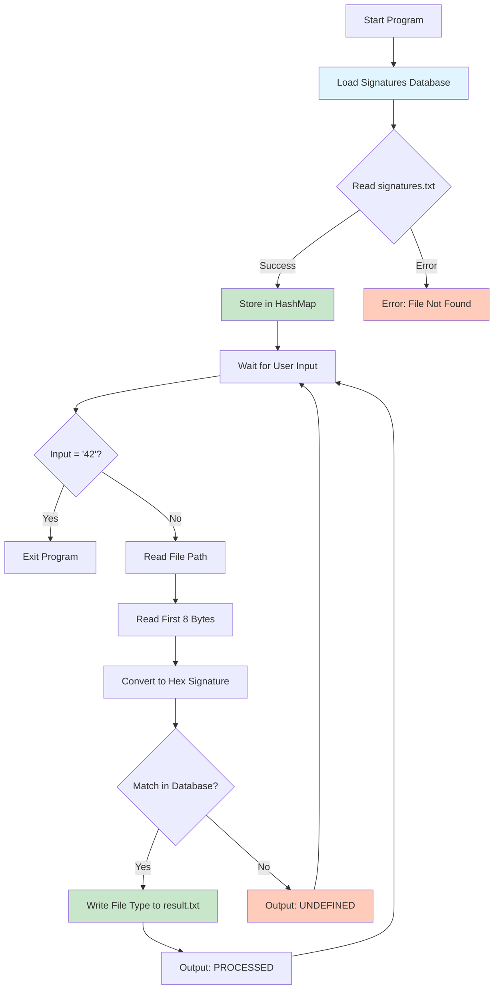

# File Signature Detector

## 📋 Project Overview

This project implements a **File Type Identifier** based on **Magic Numbers** (file signatures). It reads binary file headers and identifies file types by matching hexadecimal signatures against a known database, demonstrating low-level file I/O operations in Java.

## 🎯 Learning Objectives

### 1. **Binary File I/O Operations**
- Reading binary data using `FileInputStream`
- Understanding byte-level file manipulation
- Converting bytes to hexadecimal representation
- Working with byte arrays and buffers

### 2. **Magic Numbers (File Signatures)**
- Every file type has a unique signature in its header (first few bytes)
- File extensions can be misleading, but magic numbers don't lie
- Learning to identify files based on their actual content, not their names

### 3. **Data Structures**
- Using `HashMap<String, List<String>>` for efficient signature lookup
- Managing multiple signatures per file type (e.g., JPEG has 3 different signatures)
- Optimizing search operations with appropriate data structures

### 4. **String Manipulation**
- Parsing structured text files (CSV-like format)
- Pattern matching with `startsWith()` for flexible signature detection
- Formatting bytes as hexadecimal strings using `String.format()`

### 5. **Exception Handling**
- Proper handling of `FileNotFoundException`
- Managing `IOException` during file operations
- Graceful error reporting to users

### 6. **File Append Operations**
- Opening files in append mode with `FileOutputStream("file.txt", true)`
- Adding newline characters for proper formatting
- Preventing data overwriting in result files

### 7. **Control Flow**
- Using labeled breaks (`outerLoop:`) to exit nested loops
- Implementing interactive user input loops
- Handling termination conditions

## 🏗️ Architecture



## 🔧 Component Breakdown

### 1. **readSignatures()**
```
Purpose: Load file type signatures from database
Input:   signatures.txt (format: "FileType, HEX_SIGNATURE")
Output:  HashMap<String, List<String>>
Process:
  - Read file byte by byte
  - Parse each line into file type and signature
  - Group multiple signatures per file type
  - Handle multiple signature variants (e.g., JPEG, GIF, RAR)
```

### 2. **readInputFile()**
```
Purpose: Extract hexadecimal signature from a file
Input:   File path (String)
Output:  Hex signature string (e.g., "4D 5A 90 00")
Process:
  - Open file with FileInputStream
  - Read first 8 bytes into buffer
  - Convert each byte to 2-digit hex format
  - Return formatted signature string
```

### 3. **writeResult()**
```
Purpose: Match signature and write result
Input:   Signatures HashMap, File signature string
Output:  File type to result.txt (append mode)
Process:
  - Iterate through all known signatures
  - Use startsWith() for flexible matching
  - Write matched file type + newline to result.txt
  - Print "PROCESSED" on success
  - Print "UNDEFINED" if no match found
```

### 4. **main()**
```
Purpose: Orchestrate the program flow
Process:
  - Load signature database once at startup
  - Loop: accept user input
  - For each file: extract signature → match → output result
  - Exit when user enters "42"
```

## 📁 File Structure

```
File_Signatures/
├── Program.java          # Main application logic
├── signatures.txt        # Database of file signatures
├── result.txt           # Output file (created at runtime)
└── README.md            # This documentation
```

## 🚀 How to Run

### Compile
```bash
javac Program.java
```

### Execute
```bash
java Program
```

### Usage
```bash
# Enter file paths one by one
Notion.exe
PROCESSED

test.pdf
PROCESSED

unknown_file.dat
UNDEFINED

# Type "42" to exit
42
```

## 💡 Key Concepts Demonstrated

### 1. **Magic Numbers in Practice**
| File Type | Signature (Hex) | First Bytes (ASCII) |
|-----------|----------------|---------------------|
| EXE       | 4D 5A          | "MZ"                |
| PDF       | 25 50 44 46    | "%PDF"              |
| PNG       | 89 50 4E 47    | ".PNG"              |
| ZIP/DOCX  | 50 4B 03 04    | "PK"                |

### 2. **Why Read 8 Bytes?**
- Most file signatures are 2-8 bytes long
- Reading 8 bytes covers the majority of formats
- More efficient than reading the entire file
- Sufficient for accurate identification

### 3. **Flexible Signature Matching**
Using `startsWith()` instead of `equals()`:
- **Problem**: EXE files have signature `4D 5A` but our buffer reads `4D 5A 90 00 03 00 00 00`
- **Solution**: `fileSignature.startsWith(signature)` matches partial signatures
- Allows identification even when buffer contains extra bytes

### 4. **Append Mode File Writing**
```java
// Without append (overwrites)
new FileOutputStream("result.txt")

// With append (preserves existing content)
new FileOutputStream("result.txt", true)
```