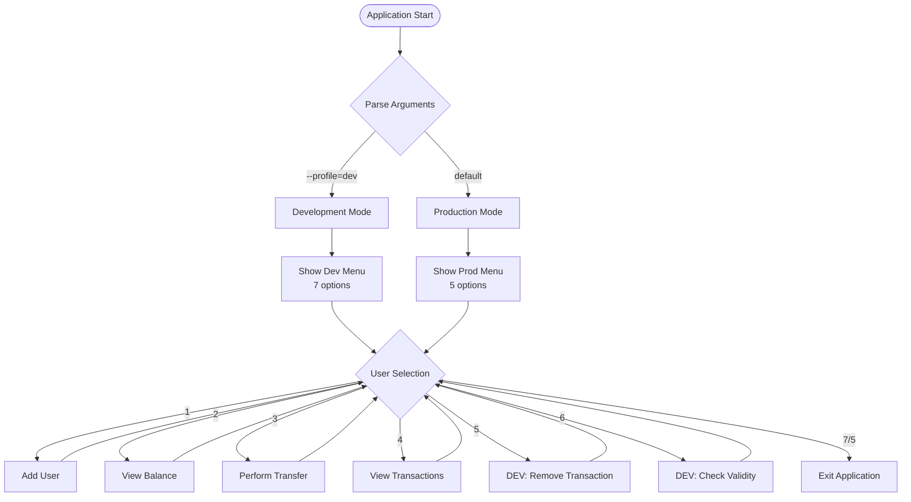
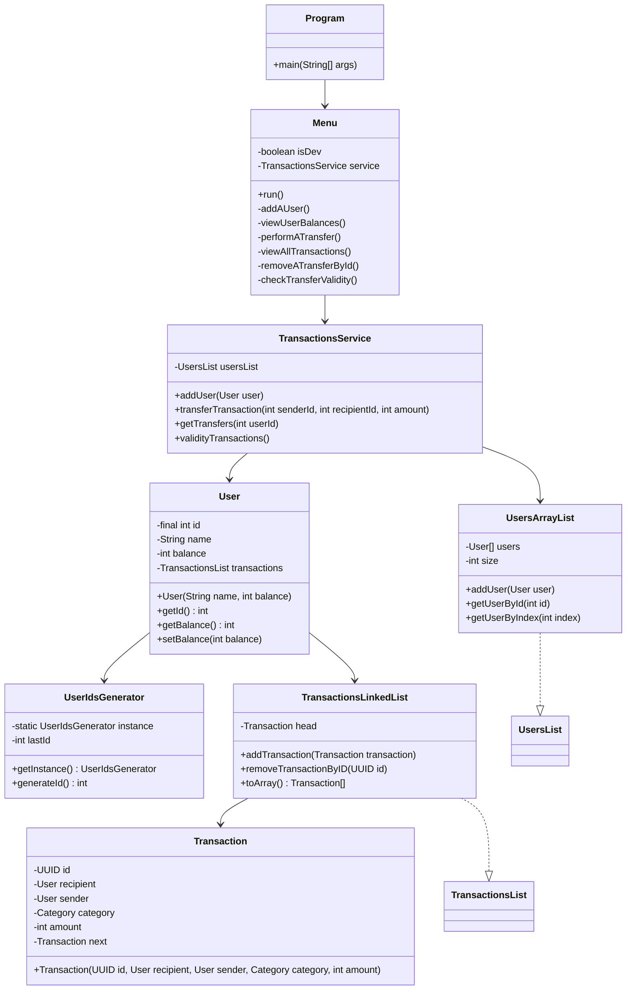
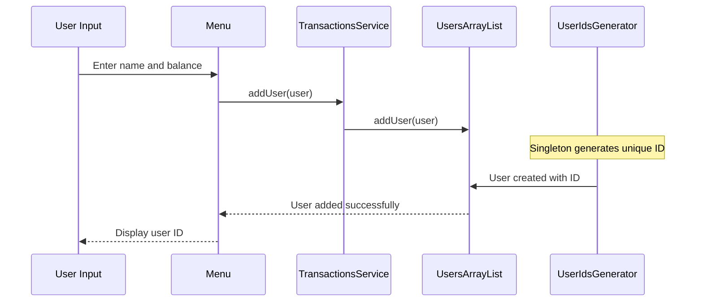
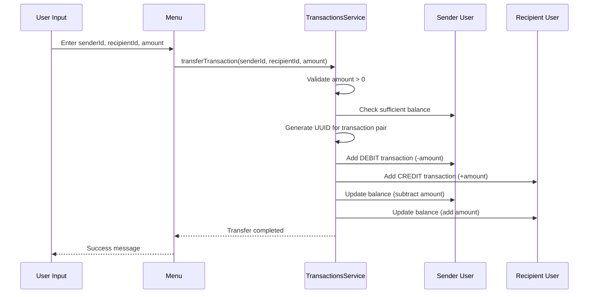

# 💰 Full-Scale Money Transfer Application

A comprehensive Java console application demonstrating advanced object-oriented programming concepts, data structures, and software architecture patterns. This project simulates a banking system with money transfer capabilities between users.

## 🎯 Project Overview

This money transfer application is a sophisticated console-based banking simulation that demonstrates:
- **Transaction Management**: Complete double-entry accounting system
- **User Management**: Dynamic user registration and balance tracking
- **Data Integrity**: Transaction validation and consistency checks
- **Error Handling**: Comprehensive exception management
- **Custom Data Structures**: Implementation of ArrayList and LinkedList from scratch

## 🏗️ Architecture

### System Architecture Diagram



## ✨ Key Features

### 🔐 User Management
- **Dynamic User Registration**: Create users with unique auto-generated IDs
- **Balance Validation**: Prevents negative balances
- **User Lookup**: Efficient user retrieval by ID or index

### 💸 Transaction System
- **Double-Entry Accounting**: Every transfer creates paired debit/credit transactions
- **Transaction Integrity**: UUID-based transaction linking
- **Balance Validation**: Prevents overdrafts
- **Transaction History**: Complete audit trail for each user

### 🛠️ Development Features
- **Debug Mode**: Special developer options (--profile=dev)
- **Transaction Validation**: Detects unpaired/orphaned transactions
- **Transaction Removal**: Developer tools for testing

### 🎮 Interactive Menu System
- **User-Friendly Interface**: Intuitive console navigation
- **Error Handling**: Comprehensive input validation
- **Conditional Features**: Dev-mode specific options

## 🧠 Core Concepts Learned

### 1. **Interface Implementation**
```java
// Abstract contract definition
interface UsersList {
    void addUser(User user);
    User getUserById(int id) throws UserNotFoundException;
}

// Concrete implementation
public class UsersArrayList implements UsersList {
    // Custom ArrayList implementation
}
```

### 2. **Design Patterns**

#### **Singleton Pattern**
```java
public class UserIdsGenerator {
    private static UserIdsGenerator instance;
    
    public static UserIdsGenerator getInstance() {
        if (instance == null)
            instance = new UserIdsGenerator();
        return instance;
    }
}
```

#### **Facade Pattern**
The `TransactionsService` class acts as a facade, providing a simplified interface to the complex subsystem of users and transactions:
```java
public class TransactionsService {
    private UsersList usersList;
    
    // Simplified interface for complex operations
    public void transferTransaction(int senderId, int recipientId, int amount) {
        // Handles validation, user lookup, transaction creation, and balance updates
    }
}
```

### 4. **Interface Implementation and Abstraction**
The project uses interfaces to define contracts and enable flexible implementations:

```java
// Abstract contract definition
interface UsersList {
    void addUser(User user);
    User getUserById(int id) throws UserNotFoundException;
}

// Concrete implementation with dynamic array
public class UsersArrayList implements UsersList {
    private User[] users;
    private int size;
    // Implementation details...
}
```

This design allows for:
- **Flexibility**: Different data structure implementations
- **Maintainability**: Changes to implementation don't affect client code
- **Testability**: Easy to create mock implementations for testing

### 5. **Exception Handling Hierarchy**
```java
// Custom exception inheritance
public class UserNotFoundException extends RuntimeException
public class TransactionNotFoundException extends RuntimeException  
public class IllegalTransactionException extends RuntimeException
```

### 6. **Data Structures Implementation**

#### **Dynamic ArrayList**
```java
// Auto-resizing array with 50% growth factor
if (size >= users.length) {
    int newSize = (3 * users.length) / 2;
    User[] newArr = new User[newSize];
    System.arraycopy(users, 0, newArr, 0, size);
    users = newArr;
}
```

#### **Linked List**
```java
// LIFO (Last In, First Out) implementation
public void addTransaction(Transaction transaction) {
    transaction.setNext(head);
    head = transaction;
}
```

## 📊 Class Structure

### Core Classes Relationship



## ⚙️ How It Works

### 1. **User Creation Process**


### 2. **Money Transfer Process**


### 3. **Double-Entry Accounting System**

Every money transfer creates **two linked transactions**:

```java
// Same UUID for both transactions ensures integrity
UUID transactionId = UUID.randomUUID();

// Sender gets DEBIT (negative amount)
Transaction debitTransaction = new Transaction(
    transactionId, recipient, sender, 
    Transaction.Category.DEBIT, -amount
);

// Recipient gets CREDIT (positive amount)  
Transaction creditTransaction = new Transaction(
    transactionId, recipient, sender,
    Transaction.Category.CREDIT, amount
);
```

## 🚀 Running the Application

### Standard Mode
```bash
java Program
```

**Available Options:**
1. Add a user
2. View user balances  
3. Perform a transfer
4. View all transactions for a specific user
7. Finish execution

### Developer Mode
```bash
java Program --profile=dev
```

**Additional Developer Options:**
5. DEV - remove a transfer by ID
6. DEV - check transfer validity

### Sample Usage Flow

```
1. Add a user
Enter a user name and a balance
John 1000
User with id = 1 is added

1. Add a user  
Enter a user name and a balance
Alice 500
User with id = 2 is added

3. Perform a transfer
Enter a sender ID, a recipient ID, and a transfer amount
1 2 200
The transfer is completed

2. View user balances
Enter a user ID
1
John - 800

4. View all transactions for a specific user
Enter a user ID
1
To Alice(id = 2) -200 with id = a1b2c3d4-e5f6-7890-abcd-ef1234567890
```
## 🎨 Design Patterns Used

### 1. **Singleton Pattern** 
- **UserIdsGenerator**: Ensures unique, sequential ID generation across the entire application
- **Purpose**: Guarantees only one instance exists and provides global access point
- **Implementation**: Lazy initialization with thread-safe instance creation

### 2. **Facade Pattern**
- **TransactionsService**: Provides a simplified, unified interface to the complex subsystem
- **Purpose**: Hides the complexity of user management, transaction creation, and balance updates
- **Benefits**: 
  - Simplifies client code (Menu class doesn't need to know about internal complexities)
  - Centralizes business logic
  - Provides a clean API for transaction operations

## 🎓 Learning Outcomes

This project demonstrates mastery of:

### **Core Java Concepts**
- ✅ Object-Oriented Programming (Encapsulation, Inheritance, Polymorphism)
- ✅ Interface implementation and abstraction
- ✅ Exception handling and custom exceptions
- ✅ Collections and data structures
- ✅ Memory management and array manipulation

### **Software Design Principles**
- ✅ Layered architecture implementation
- ✅ Separation of concerns (presentation, service, data layers)
- ✅ Design patterns (Singleton, Facade)
- ✅ Interface-based programming for flexibility
- ✅ Error handling best practices

### **Advanced Programming Techniques**
- ✅ UUID generation and management
- ✅ Double-entry accounting system implementation
- ✅ Custom data structure development
- ✅ Algorithm design for data validation
- ✅ Memory-efficient dynamic arrays

### **Software Engineering Practices**
- ✅ Modular code organization
- ✅ Comprehensive error handling
- ✅ Input validation and sanitization
- ✅ User experience design (console interface)
- ✅ Debug mode implementation
