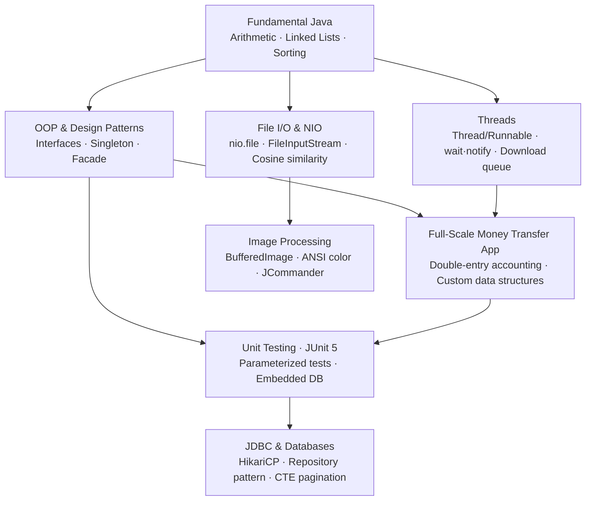
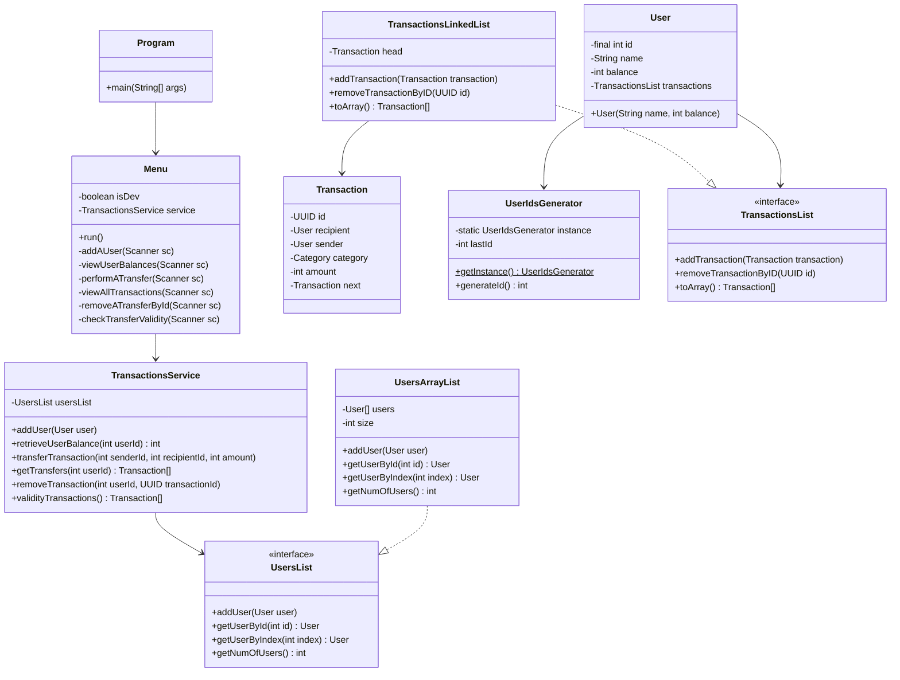
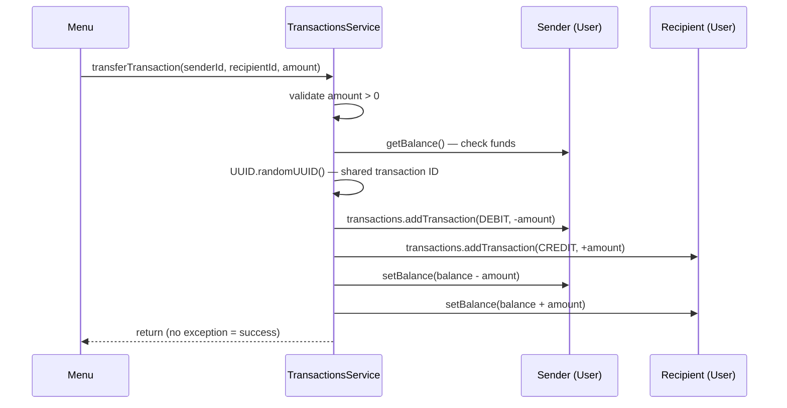

# Java Programming Practice — Self-Study Repository

Java is not in the 42 curriculum. This repo covers what I taught myself: OOP design patterns, data structures built by hand before touching `java.util`, multithreading from `wait`/`notify` up to a real download queue, file I/O with NIO, cosine-similarity text analysis, and a full JDBC stack with HikariCP and CTE pagination. The final module has JUnit 5 parameterized tests against both an embedded database and a live PostgreSQL instance.

---

## Learning Roadmap



---

## Module Breakdown

### 📁 Fundamental_Java_Programming — Core Algorithm Exercises

**What it covers:** Six progressive exercises covering Java primitives, `Scanner` input validation, and hand-rolled linked lists.

**Key classes:** `Program` (one per exercise, each self-contained)

**Concepts practiced:**
- Digit extraction via modulo / integer division (`ex00`: digit sum of 479598)
- Trial-division primality test up to √n with iteration counter (`ex01`)
- Composite digit-sum loop terminating on sentinel value 42 (`ex02`)
- Manual singly-linked list (`WeekNode`) for weekly grade tracking, no `java.util` (`ex03`)
- Character-frequency histogram: frequency array over 65536 Unicode code points, bubble-sort on a custom linked list, ASCII bar chart rendering (`ex04`)
- Multi-entity linked list management: `StudentList`, `CLassList`, `AttendanceList` with cross-reference validation and a date-to-weekday algorithm anchored to September 1, 2020 (`ex05`)

**Note:** `ex04` skips HashMap entirely. A 65536-element int array indexed by `char` cast to `int` gives direct access to any Unicode code point's frequency. Each character is its own index.

---

### 📁 Full-Scale_Money_Transfer_App — Flagship Banking Simulation

**What it covers:** A console banking application with user management, balance transfers, and double-entry accounting. Every transfer produces two transactions sharing one UUID — one debit, one credit.

**Key classes:** `TransactionsService`, `Menu`, `User`, `Transaction`, `UsersArrayList`, `TransactionsLinkedList`, `UserIdsGenerator`

**Concepts practiced:**
- Singleton pattern (`UserIdsGenerator`) with lazy initialization
- Facade pattern (`TransactionsService` hides user lookup, transaction creation, and balance mutation behind a single `transferTransaction` method)
- Interface-based programming (`UsersList`, `TransactionsList`) with swappable concrete implementations
- Custom `ArrayList` with 1.5× growth factor (`(3 * length) / 2`) via `System.arraycopy`
- LIFO linked list with prepend strategy: `transaction.setNext(head); head = transaction`
- UUID-based transaction pairing; `validityTransactions()` uses `HashMap<UUID, Integer>` to detect count ≠ 2
- Runtime `--profile=dev` flag to unlock diagnostic menu options (remove transaction by ID, check validity)
- Three custom `RuntimeException` subclasses: `UserNotFoundException`, `TransactionNotFoundException`, `IllegalTransactionException`

**Note:** `validityTransactions()` iterates all users, accumulates their transactions into an ArrayList, and counts UUID occurrences in a HashMap. Any UUID with count ≠ 2 is an orphan. Catches one-sided deletions in O(n).

---

### 📁 Threads — Concurrency from Basics to Worker Pools

**What it covers:** Three separate exercises covering thread creation, `synchronized` monitor coordination, parallel array summation, and a multi-threaded file downloader with a shared work queue.

**Key classes:** `Manager`, `Egg`, `Hen` (Basics); `SumThread` (Multithreading); `DownloadThread`, `DownloadQueue` (File_downloader)

**Concepts practiced:**
- Both thread creation styles: `extends Thread` and `implements Runnable`
- `synchronized` methods with `wait()` / `notify()` for strict alternation — `Manager` holds a boolean turn flag; each side loops on `while (!myTurn)` before printing
- Parallel array summation: ceiling division `(size + count - 1) / count` partitions a random-filled array evenly across N threads, each writing to a distinct index in a shared `int[]` (no contention, no locks)
- `DownloadQueue.getCurrentFileNumber()` returns `null` to signal exhaustion so threads exit cleanly without a coordinator
- `java.net.URI` → `URL.openStream()` + `Files.copy` with `StandardCopyOption.REPLACE_EXISTING` for actual file downloads
- `thread.join()` for barrier synchronisation after spawning

**Note:** `DownloadQueue` uses a single synchronized counter method. Threads call it in a loop until it returns `null`, then stop. Basically reimplementing `AtomicInteger` by hand to understand why it exists.

---

### 📁 Files_IO_package — Three File I/O Tools

**What it covers:** Three standalone programs covering NIO path navigation, binary magic-byte detection, and cosine-similarity text comparison.

**Key classes:** `Program` (one per sub-folder)

**Concepts practiced:**
- `java.nio.file`: `Files.list()`, `Files.move()`, `Path.resolve()`, `Paths.get()` — a mini shell with `ls`, `cd`, and `mv` (`File_Manager`)
- `FileInputStream` byte-level reading; first-8-byte hex signature extraction with `String.format("%02X ", b & 0xFF)` (`File_Signatures`)
- Cosine similarity: `TreeSet` dictionary, `Vector<Integer>` frequency vectors, `DecimalFormat` with `RoundingMode.DOWN`, output to `dictionary.txt` via `BufferedWriter` (`Files_Similarity`)
- 10 MB file size guard before reading (`Files_Similarity`)

**Note:** `File_Signatures` uses a labeled break (`outerLoop:`) to exit a nested for-each as soon as a signature match is found. One of the few places where Java's labeled break is the right call.

---

### 📁 ImagesToChar — BMP to Terminal Art

**What it covers:** Converts a BMP image into colored block characters (`█`) printed to the terminal, using `javax.imageio.ImageIO` for pixel decoding and JColor for ANSI escape codes.

**Key classes:** `ImgConvert`, `Args`, `Main`

**Concepts practiced:**
- `BufferedImage.getRGB(x, y)` with bitmask extraction: `red = (pixels >> 16) & 0xff`, `green = (pixels >> 8) & 0xff`, `blue = pixels & 0xff`
- Brightness threshold: if R, G, B all > 128 → white character, else black
- `JCommander` `@Parameter` annotation for `--white` and `--black` CLI flags
- `getClass().getClassLoader().getResourceAsStream()` for classpath resource loading
- Fat JAR packaging with a hand-written `manifest.txt` specifying `Main-Class`

**Note:** The brightness threshold is a single-value grayscale approximation, not luminance-weighted. Works fine for high-contrast BMP input; would fall apart on gradients.

---

### 📁 TESTS — JUnit 5 Parameterized Tests + Embedded Database

**What it covers:** A Maven project (Java 21, JUnit 6.1.0-M1) with parameterized unit tests and a Spring-managed in-memory database for integration testing.

**Key classes:** `NumberWorker`, `NumberWorkerTest`, `EmbeddedDataSourceTest`

**Concepts practiced:**
- `@ParameterizedTest` with `@ValueSource(ints = {...})` for inline test data
- `@CsvFileSource(resources = "/data.csv")` to drive `digitsSum` tests from a 10-row CSV
- `assertThrowsExactly(IllegalNumberException.class, ...)` to test exception type precisely, not just any throwable
- `@BeforeEach` setup with `EmbeddedDatabaseBuilder` (HSQL, scripts: `schema.sql` + `data.sql`)
- `assertNotNull(dataSource.getConnection())` as a connectivity smoke test

**Note:** The CSV-driven `digitsSum` test includes negative inputs (`-123` → 6, `-555` → 15). `NumberWorker.digitsSum` calls `Math.abs` first, and the test data validates that boundary explicitly.

---

### 📁 Chat — JDBC, HikariCP, Repository Pattern

**What it covers:** A chat application backend (Maven, Java 21, PostgreSQL) with full JDBC CRUD, connection pooling, CTE-based pagination, and the Repository pattern.

**Key classes:** `MessagesRepositoryJdbcImpl`, `UsersRepositoryJdbcImpl`, `DatabaseConfig`, `User`, `Chatroom`, `Message`

**Concepts practiced:**
- `PreparedStatement` with parameterized queries; `Statement.RETURN_GENERATED_KEYS` to retrieve auto-generated IDs after INSERT
- `Optional<Message>` return type for nullable find-by-ID results
- Null-safe UPDATE: `setNull(2, Types.TIMESTAMP)` when `dateTime` is null
- FK pre-validation before INSERT/UPDATE using `SELECT EXISTS(...)`, raises `NotSavedSubEntityException` before touching the main table
- CTE (`WITH paginated_users AS (...)`) + `LEFT JOIN` to fetch users with their chatrooms in one query
- `ResultSet` deduplication: `HashMap<Long, User>` + `HashMap<Long, Set<Long>>` to collapse multiple JOIN rows per user, with `wasNull()` checks for SQL NULLs
- HikariCP: `maxPoolSize=8`, `minIdle=4`, `leakDetectionThreshold=60000`, `cachePrepStmts=true`, `prepStmtCacheSize=250`
- `equals`/`hashCode` on `Long id` via `Objects.equals` / `Objects.hash` across all three model classes

**Note:** The `findAll` CTE handles the many-to-many user↔chatroom join in one round-trip. Without it: N+1 queries, one per user.

---

## Flagship Project Deep Dive — Full-Scale Money Transfer App

### Class Diagram



### Transfer Sequence



### Architecture

Three layers. `Menu` handles I/O and input validation. `TransactionsService` handles business rules: balance checks, UUID pairing, validity scanning. `UsersArrayList` and `TransactionsLinkedList` handle storage. Nothing reaches upward.

`UserIdsGenerator` is a Singleton because the ID counter has to be global and monotonic — two instances would produce duplicate IDs. `TransactionsService` is a Facade: `Menu` calls one method (`transferTransaction`) and the service handles user lookups, UUID generation, two `Transaction` objects, two list insertions, and two balance updates internally.

The accounting model: every transfer produces two `Transaction` records with the same UUID, one debit and one credit. `validityTransactions()` counts UUID occurrences in a `HashMap<UUID, Integer>`. Any UUID with a count other than 2 is an orphan — someone deleted one side of the pair. Real double-entry accounting systems enforce the same constraint.

---

## Testing

| Module | Framework | Coverage |
|--------|-----------|----------|
| `TESTS/NumberWorkerTest` | JUnit 5 (6.1.0-M1) | `isPrime`: primes, composites, boundary exceptions; `digitsSum`: 10 CSV cases |
| `TESTS/EmbeddedDataSourceTest` | JUnit 5 + Spring JDBC + HSQL | HSQL in-memory DB init from SQL scripts; connection non-null smoke test |
| `Full-Scale_Money_Transfer_App` | None (manual) | — |
| `Chat` | None (manual) | — |
| All others | None | — |

**NumberWorkerTest** has four parameterized groups. Three use `@ValueSource`: primes (`{11, 29, 17}`), composites (`{4, 9, 24}`), and illegal inputs (`{0, 1, -2}`) where `assertThrowsExactly` checks that `IllegalNumberException` fires specifically — not just any throwable. The fourth uses `@CsvFileSource` with `data.csv`, ten rows of `number,digitsSum` pairs including negatives.

**EmbeddedDataSourceTest** uses `@BeforeEach` to rebuild a fresh HSQL database from `schema.sql` and `data.sql` before each test. The test itself checks the connection is non-null. It's a smoke test for the Spring JDBC wiring, not the schema logic.

---

## Tech Stack

| Category | Technology |
|---|---|
| Language | Java 21 |
| Build | Maven 3.x (Chat, TESTS modules) |
| Testing | JUnit Jupiter 6.1.0-M1 (API + Engine + Params) |
| Database (integration) | HSQLDB 2.7.4 via Spring JDBC EmbeddedDatabaseBuilder |
| Database (Chat) | PostgreSQL (BIGSERIAL PKs, FK constraints, junction table) |
| Connection pooling | HikariCP 7.0.2 |
| JDBC driver | PostgreSQL JDBC 42.7.8 |
| CLI arg parsing | JCommander 3.0 (ImagesToChar) |
| ANSI color | JColor 5.5.1 (ImagesToChar) |
| Image decoding | `javax.imageio.ImageIO` / `java.awt.image.BufferedImage` |
| Concurrency APIs | `java.lang.Thread`, `synchronized`, `wait/notify`, `java.net.URI/URL`, `java.nio.file.Files` |

---

## How to Run

### Full-Scale Money Transfer App (no build file — compile manually)

```bash
cd Full-Scale_Money_Transfer_App

# Compile all sources
javac *.java

# Run in production mode
java Program

# Run in developer mode (adds remove-transaction and validity-check menu items)
java Program --profile=dev
```

### TESTS module (Maven)

```bash
cd TESTS
mvn test
```

### Chat module (Maven + PostgreSQL)

```bash
# 1. Create the database and apply schema
psql -U postgres -c "CREATE DATABASE chat_db;"
psql -U postgres -d chat_db -f src/main/resources/schema.sql
psql -U postgres -d chat_db -f src/main/resources/data.sql

# 2. Update credentials in DatabaseConfig.java if needed

# 3. Build and run
cd Chat
mvn clean compile
mvn exec:java -Dexec.mainClass="fr.fortyTwo.chat.app.Program"
```

### ImagesToChar (fat JAR)

```bash
cd ImagesToChar/src
javac -cp ../lib/JColor-5.5.1.jar:../lib/jcommander-3.0.jar \
      java/fr/fortyTwo/printer/app/Main.java \
      java/fr/fortyTwo/printer/logic/*.java -d .

jar cfm ImagesToChar.jar manifest.txt fr/

java -jar ImagesToChar.jar --white=WHITE --black=RED
```

### Threads — Multithreading

```bash
cd Threads/Multithreading
javac *.java
java Program --arraySize=100000 --threadsCount=4
```

### Threads — File Downloader

```bash
cd Threads/File_downloader
# Edit files_urls.txt — one URL per line
javac *.java
java Program --threadsCount=3
```

### Files_IO — File Manager

```bash
cd Files_IO_package/File_Manager
javac Program.java
java Program --current-folder=/your/start/path
# then type: ls, cd subdir, mv file dest, exit
```