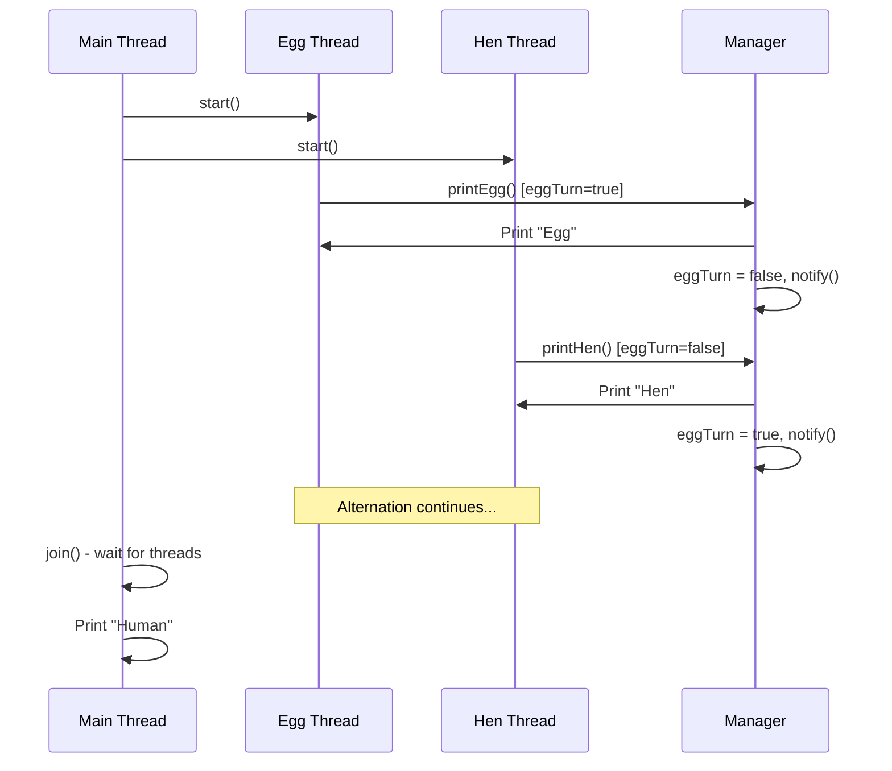

# Thread Basics - Synchronized Thread Coordination

## Overview
This exercise demonstrates fundamental thread synchronization using Java's `wait()` and `notify()` mechanisms. It implements a classic concurrency problem where two threads must alternate their execution in a coordinated manner.

## Problem Statement
Create a multithreading application where:
- Two threads (`Egg` and `Hen`) print their names alternately
- A third thread (`Human`) waits for both to complete before printing
- The execution must be strictly alternating: Egg → Hen → Egg → Hen...

## Program Architecture

### Class Structure
```
Basics/
├── Program.java        # Main class extending Thread
├── Egg.java           # Runnable implementation for Egg thread
├── Hen.java           # Runnable implementation for Hen thread
└── Manager.java       # Synchronization coordinator
```

### Component Responsibilities

#### **Program.java** (Thread Implementation)
- Extends `Thread` class
- Creates and manages Egg and Hen threads
- Uses `join()` to wait for thread completion
- Prints "Human" after both threads finish

#### **Egg.java & Hen.java** (Runnable Implementation)
- Both implement `Runnable` interface
- Delegate printing to shared `Manager` object
- Run for a specified number of iterations

#### **Manager.java** (Synchronization Coordinator)
- Coordinates alternating execution
- Uses `synchronized` methods
- Implements `wait()` and `notify()` for thread communication
- Maintains turn-based state with boolean flag

## How It Works

### Synchronization Pattern

```java
public synchronized void printEgg() {
    while (!eggTurn) {
        wait();  // Wait until it's egg's turn
    }
    System.out.println("Egg");
    eggTurn = false;  // Switch turn
    notify();  // Wake up waiting thread
}

public synchronized void printHen() {
    while (eggTurn) {
        wait();  // Wait until it's hen's turn
    }
    System.out.println("Hen");
    eggTurn = true;  // Switch turn
    notify();  // Wake up waiting thread
}
```

### Execution Flow



## Core Java Concepts Learned

### 1. **Thread Creation Methods**

**Extending Thread Class**:
```java
public class Program extends Thread {
    @Override
    public void run() {
        // Thread logic
    }
}
```

**Implementing Runnable Interface**:
```java
public class Egg implements Runnable {
    @Override
    public void run() {
        // Thread logic
    }
}
```

### 2. **Thread Synchronization**

**synchronized Keyword**:
- Ensures only one thread executes a method at a time
- Provides mutual exclusion on the object's monitor

**wait() and notify()**:
- `wait()`: Releases lock and sleeps until notified
- `notify()`: Wakes up one waiting thread
- Must be called within synchronized context

### 3. **Thread Lifecycle Management**

**Thread Methods Used**:
```java
thread.start()  // Begin thread execution
thread.join()   // Wait for thread to complete
```

### 4. **Inter-Thread Communication**

The `Manager` class demonstrates the **producer-consumer pattern**:
- Shared state (`eggTurn` boolean)
- Conditional waiting (`while` loop + `wait()`)
- Notification mechanism (`notify()`)

## Algorithm Complexity

- **Time Complexity**: O(n) where n = count parameter
- **Space Complexity**: O(1) - constant space for threads
- **Concurrency**: 3 threads running (Egg, Hen, Human)

## Usage

### Compilation
```bash
cd Threads/Basics
javac *.java
```

### Execution
```bash
java Program --count=<NUMBER>
```

### Example
```bash
java Program --count=5
```

**Output**:
```
Egg
Hen
Egg
Hen
Egg
Hen
Egg
Hen
Egg
Hen
Human
Human
Human
Human
Human
```

## Key Learning Outcomes

### ✅ Concurrency Fundamentals
- Understanding race conditions and data races
- Need for synchronization in shared state access
- Thread-safe method implementation

### ✅ Synchronization Mechanisms
- Using `synchronized` keyword for mutual exclusion
- Inter-thread communication with `wait()` and `notify()`
- Avoiding deadlocks with proper lock management

### ✅ Thread Coordination
- Using `join()` to ensure execution order
- Coordinating multiple threads with shared objects
- Implementing turn-based execution

### ✅ Best Practices
- Always use `while` (not `if`) with `wait()` to handle spurious wakeups
- Call `wait()` and `notify()` only in `synchronized` context
- Close resources properly (threads complete execution)

## Common Pitfalls Avoided

1. **Spurious Wakeups**: Using `while` instead of `if` before `wait()`
   ```java
   while (!eggTurn) { wait(); }  // ✅ Correct
   if (!eggTurn) { wait(); }     // ❌ Wrong
   ```

2. **Deadlock Prevention**: Always `notify()` after state change

3. **IllegalMonitorStateException**: All `wait()`/`notify()` calls in synchronized methods

## Related Concepts

- **Producer-Consumer Problem**: Similar coordination pattern
- **Semaphores**: Alternative synchronization mechanism
- **Locks (ReentrantLock)**: Modern alternative to synchronized
- **Condition Variables**: More flexible than wait/notify

## Real-World Applications

This pattern is fundamental to:
- **Resource pooling**: Coordinating access to limited resources
- **Task scheduling**: Alternating between different job types
- **Message passing**: Producer-consumer queues
- **State machines**: Turn-based systems

---

This exercise provides a solid foundation for understanding Java threading and synchronization, essential for building concurrent applications.
