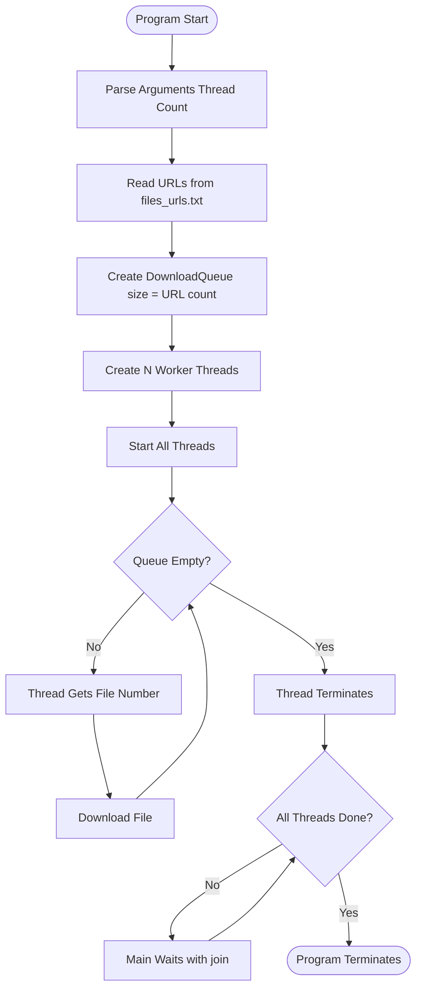

# Concurrent File Downloader - Thread Pool Pattern

## Overview
This exercise demonstrates a practical implementation of the **thread pool pattern** for concurrent file downloads. Multiple worker threads process download tasks from a shared queue, showcasing efficient resource management and parallel I/O operations.

## Problem Statement
Create a multithreaded file downloader that:
- Reads URLs from a configuration file
- Spawns a configurable number of worker threads
- Downloads multiple files concurrently
- Coordinates work distribution among threads
- Ensures all downloads complete before program termination

## Program Architecture

### Class Structure
```
File_downloader/
├── Program.java         # Main entry point and orchestration
├── DownloadThread.java  # Worker thread for downloading
├── DownloadQueue.java   # Synchronized work queue
└── files_urls.txt      # Input file containing URLs
```

### Component Responsibilities

#### **Program.java** (Orchestrator)
- Parses command-line arguments
- Reads URLs from configuration file
- Creates and manages thread pool
- Waits for all downloads to complete

#### **DownloadThread.java** (Worker)
- Extends `Thread` class
- Fetches work from shared queue
- Downloads files using Java NIO
- Handles errors gracefully

#### **DownloadQueue.java** (Work Coordinator)
- Thread-safe work distribution
- Atomic file number generation
- Signals completion when queue is empty

## How It Works

### Thread Pool Pattern



### Synchronization Strategy

**DownloadQueue** (Thread-Safe Work Distribution):
```java
public class DownloadQueue {
    private int currentFileNumber = 0;
    private int totalFiles;
    
    public synchronized Integer getCurrentFileNumber() {
        if (currentFileNumber < totalFiles)
            return ++currentFileNumber;
        return null;  // Signal no more work
    }
}
```

**Why This Works**:
- `synchronized` ensures atomic increment
- Returns `null` when all files are assigned
- No explicit locking needed by workers

### Worker Thread Pattern

```java
@Override
public void run() {
    while (true) {
        Integer fileNum = queue.getCurrentFileNumber();
        
        if (fileNum == null)  // No more work
            break;
        
        downloadFile(fileNum);
    }
}
```

**Consumer Pattern**:
- Poll queue for work
- Process task (download file)
- Repeat until queue signals completion

## Core Java Concepts Learned

### 1. **Thread Pool Pattern**

**Benefits**:
- ✅ Limits concurrent resource usage (network connections)
- ✅ Reuses threads instead of creating/destroying
- ✅ Work queue distributes load evenly

**Implementation**:
```java
DownloadThread[] threads = new DownloadThread[count];
for (int i = 0; i < count; i++) {
    threads[i] = new DownloadThread(queue, urls);
    threads[i].setName("Thread-" + (i + 1));
    threads[i].start();
}
```

### 2. **File Download with Java NIO**

**Modern Approach**:
```java
URI uri = new URI(urlString);
URL url = uri.toURL();

try (InputStream in = url.openStream()) {
    Files.copy(in, Paths.get(fileName), 
               StandardCopyOption.REPLACE_EXISTING);
}
```

**Key Points**:
- Try-with-resources ensures stream closure
- `Files.copy()` efficiently transfers data
- `REPLACE_EXISTING` handles duplicate downloads

### 3. **Thread Coordination with join()**

```java
for (DownloadThread thread : threads) {
    try {
        thread.join();  // Wait for this thread to complete
    } catch (InterruptedException e) {
        System.err.println("Thread interrupted: " + e.getMessage());
    }
}
```

**Purpose**:
- Main thread waits for all workers to finish
- Ensures program doesn't exit prematurely
- Provides clean shutdown

### 4. **Atomic Operations**

**Synchronized Method**:
```java
public synchronized Integer getCurrentFileNumber() {
    if (currentFileNumber < totalFiles)
        return ++currentFileNumber;
    return null;
}
```

**Thread Safety**:
- Only one thread executes at a time
- Prevents race conditions on counter
- No need for explicit locks

## Algorithm Complexity

### Performance Analysis

| Aspect | Complexity | Notes |
|--------|-----------|-------|
| **Time** | O(n/t × d) | n=files, t=threads, d=download time |
| **Space** | O(n + t) | URL list + thread overhead |
| **Speedup** | Up to t× | Linear with thread count (I/O bound) |

## Usage

### Setup
Create `files_urls.txt` with one URL per line:
```
https://example.com/file1.pdf
https://example.com/file2.jpg
https://example.com/file3.zip
```

### Compilation
```bash
cd Threads/File_downloader
javac *.java
```

### Execution
```bash
java Program --threadsCount=<NUMBER>
```

### Examples

**Single Thread** (Sequential):
```bash
java Program --threadsCount=1
```
Output:
```
Thread-1 start download file number 1
Thread-1 finish download file number 1
Thread-1 start download file number 2
Thread-1 finish download file number 2
```

**Multiple Threads** (Concurrent):
```bash
java Program --threadsCount=3
```
Output:
```
Thread-1 start download file number 1
Thread-2 start download file number 2
Thread-3 start download file number 3
Thread-1 finish download file number 1
Thread-1 start download file number 4
Thread-2 finish download file number 2
Thread-3 finish download file number 3
```

## Key Learning Outcomes

### ✅ Concurrency Patterns
- **Thread Pool**: Managing fixed number of worker threads
- **Producer-Consumer**: Queue distributes work to consumers
- **Work Stealing**: Threads automatically get next task

### ✅ Practical Multithreading
- Creating and managing multiple threads
- Thread naming for debugging (`setName()`)
- Graceful shutdown with `join()`

### ✅ Synchronization
- Using `synchronized` for atomic operations
- Lock-free design with careful method design
- Avoiding deadlocks with simple locking

### ✅ I/O Operations
- Network programming with Java
- File I/O with NIO package
- Resource management with try-with-resources

### ✅ Error Handling
- Graceful failure on download errors
- Continuing execution despite individual failures
- Proper exception handling in threads

## Design Patterns Demonstrated

### 1. **Thread Pool Pattern**
```
Fixed Pool of Workers → Process Tasks from Queue → Auto-distributes Load
```

### 2. **Producer-Consumer Pattern**
```
Main Thread (Producer) → Creates Work Queue → Worker Threads (Consumers)
```

### 3. **Worker Thread Pattern**
```
Loop { Get Task → Process → Repeat } Until Queue Empty
```

## Best Practices Followed

### ✅ Resource Management
```java
try (InputStream in = url.openStream()) {
    // Automatically closed, even on exception
}
```

### ✅ Error Isolation
- Download failures don't crash other threads
- Each thread handles its own exceptions

### ✅ Clean Shutdown
```java
for (DownloadThread thread : threads) {
    thread.join();  // Wait for completion
}
```

### ✅ Debugging Support
```java
threads[i].setName("Thread-" + (i + 1));
// Thread names appear in logs and stack traces
```

## Real-World Applications

This pattern is used in:
- **Web Scrapers**: Downloading multiple pages concurrently
- **Backup Systems**: Parallel file transfers
- **Media Downloaders**: Video/audio streaming applications
- **Package Managers**: Concurrent dependency downloads
- **Cloud Storage Sync**: Multi-file synchronization

---

This exercise provides hands-on experience with real-world concurrent programming, teaching the fundamentals of thread pools and parallel I/O operations - skills essential for modern application development.
